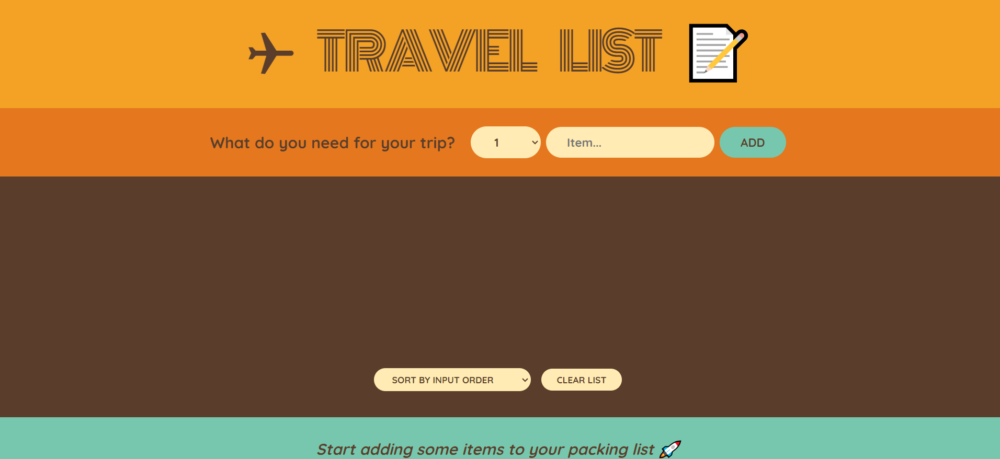

# Travel List App

This project is a simple packing list application built with React. Users can add items they need to pack for a trip, mark items as packed or unpacked, delete items, and clear the entire list. The application utilizes React hooks for state management and localStorage for persisting data across sessions. It consists of several components including a logo component, a form component for adding items, a packing list component for displaying and managing the list of items, and a stats component for displaying statistics about the list. Overall, the project provides a user-friendly interface for managing packing lists efficiently.

## Table of contents

- [Overview](#overview)
  - [The challenge](#the-challenge)
  - [Screenshots](#screenshot)
  - [Links](#links)
- [My process](#my-process)
  - [Built with](#built-with)
  - [What I learned](#what-i-learned)
- [Author](#author)
- [Acknowledgments](#acknowledgments)

## Overview

### The challenge

Users should be able to:

- Add Items: Enter items they wish to pack for their trip🎒, ensuring nothing essential is overlooked.
- Track Packing Progress: Check off items as they are packed, keeping an organized record of completed tasks✅.
- Sort Items: Arrange the list based on input order, packed status, or item description for enhanced organization and accessibility.
- Clear List: Easily clear the entire list once all items are packed, ensuring a clean slate for future trips.

### Screenshots

### Links

- Github URL: [Github Repo]()
- Live Site URL: [Project Link]()

## My process

### Built with

- Semantic HTML5 markup
- CSS custom properties
- [React](https://reactjs.org/) - JS library
- Vite with react
- Functional Component
- States and Props
- useState
- Props Drilling
- Controlled components
- useEffect
- Local Storage

### What I learned

Here, I used the concept of prop drilling here, which we can use to pass the variables of one component to its sibling components. I learned about controlled components and how we can convert uncontrolled components to controlled ones. A new concept was introduced here, which I have learned, and that is local storage. I store user's trip items in local storage, and on refresh, the trip items will still be there on a new load.

## Author

- Frontend Mentor - [Nitesh Chaudhary](https://www.frontendmentor.io/profile/Nitesh-bit)

## Acknowledgments

I would like to thanks Udemy for continuous learning. And also I would like to thanks ChatGPT and MDN as they helped me to solve mostly all my errors I encountered making this challenge.
